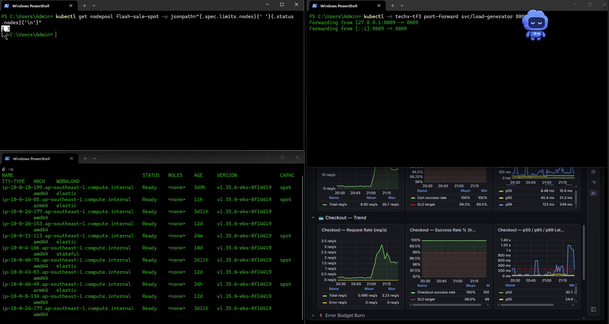
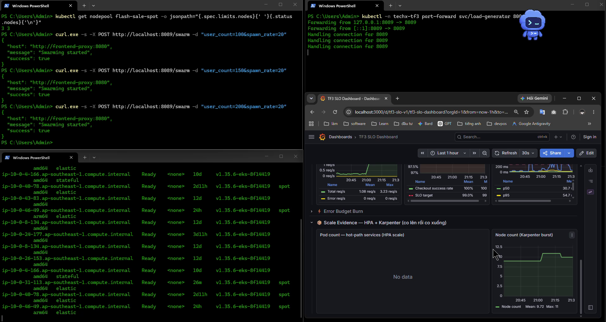
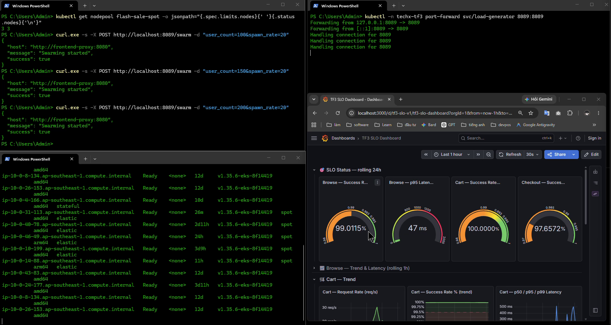
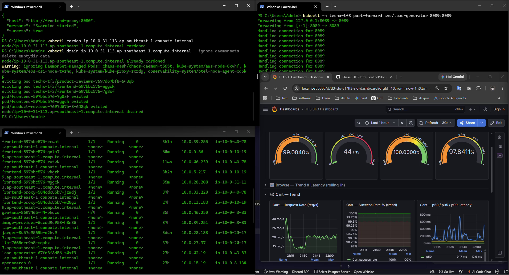
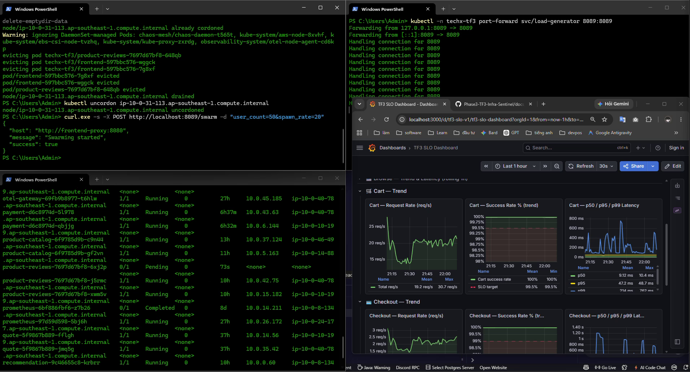
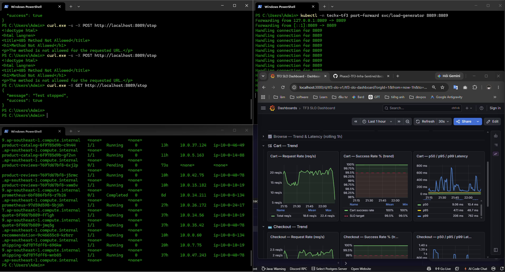
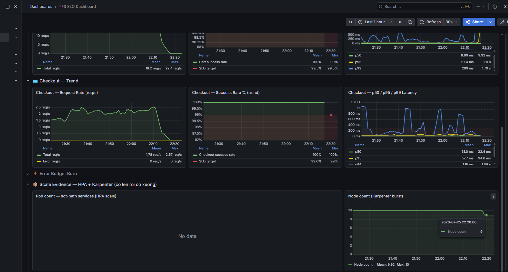
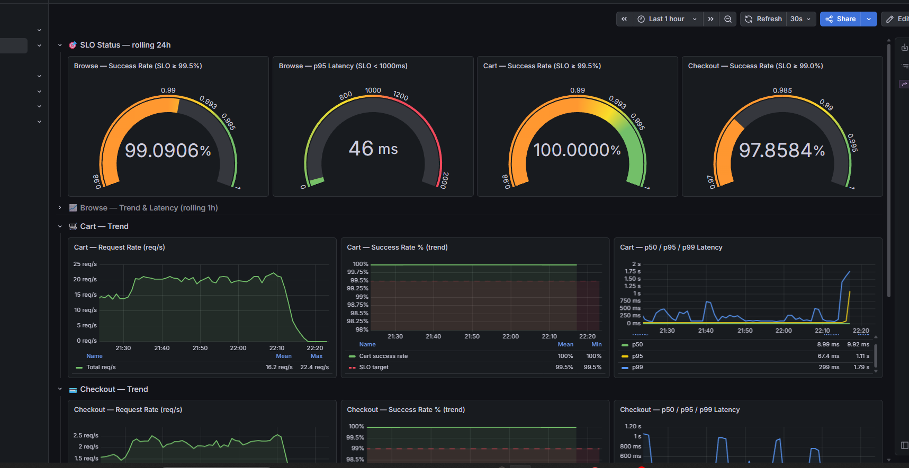

# BÁO CÁO NGHIỆM THU TẠM THỜI - MANDATE 13
## Runtime evidence và video demo Spot / Graviton trên production

**Ngày thực hiện:** 25/07/2026  
**Nhóm:** CDO02 - Reliability + Cost Optimization  
**Người tổng hợp:** Hà Tây Nguyên  
**Phạm vi báo cáo:** runtime evidence trên production, tập trung vào scale-up, headroom, inventory node và video quay màn hình  
**Trạng thái hiện tại:** đủ dùng để nộp evidence Mandate 13, còn 1 điểm cần ghi chú rõ về cách tính Spot ratio do có node exception phục vụ chaos tooling

---

## 1. Kết luận điều hành

Buổi quay ngày **25/07/2026** đã chứng minh được bốn điểm giá trị nhất ở thời điểm hiện tại:

1. production đang có **Spot node thật**, gồm cả `amd64` và `arm64`
2. NodePool `flash-sale-spot` đã được mở trần lên **3 node** và tại thời điểm evidence đang ở trạng thái **`3/3`**
3. load test đã vào thật trên `browse / cart / checkout`, thể hiện rõ qua `Request Rate` trên Grafana
4. Grafana đã ghi nhận **Node count tăng** trong cửa sổ quay, phù hợp với hành vi burst capacity
5. đã có **drain demo trên Spot node thật** với terminal `cordon/drain`, kèm bằng chứng pod bị evict và hệ thống vẫn phục vụ
6. đã có **evidence scale-down**: sau khi hạ tải và dừng test, `Node count` co từ `10 -> 9`

Điểm cần ghi chú rõ trong báo cáo:

- production hiện có **1 node on-demand exception** dành riêng cho chaos / fault injection
- nếu **loại node exception này khỏi baseline app-tier**, Spot ratio của fleet phục vụ application là **5/8 = 62.5%**
- nếu **tính cả node exception**, Spot ratio toàn cụm tại thời điểm snapshot là **5/9 = 55.6%**
- theo cả hai cách nhìn, hệ thống đều **vượt ngưỡng 50% Spot**

Vì vậy, tài liệu này được trình bày như **báo cáo runtime evidence + interruption evidence + scale-down evidence** cho Mandate 13.

---

## 2. Tóm tắt runtime tại thời điểm quay

### 2.1. Spot pool

| Hạng mục | Giá trị |
|---|---|
| NodePool | `flash-sale-spot` |
| `spec.limits.nodes` | `3` |
| `status.nodes` | `3` |
| Diễn giải | pool Spot amd64 đã full headroom tại thời điểm quay |

### 2.2. Inventory node quan sát được

**Spot amd64**

- `ip-10-0-10-199`
- `ip-10-0-40-78`
- `ip-10-0-31-113`

**Spot arm64**

- `ip-10-0-14-88`
- `ip-10-0-46-49`

**On-demand exception phục vụ fault injection / chaos**

- `ip-10-0-4-166.ap-southeast-1.compute.internal`

### 2.3. Vì sao tăng load nhưng không thấy thêm Spot amd64 thứ 4

Đây là điểm dễ bị hiểu nhầm nhất, nên cần chốt rõ:

- Load **đã vào thật**, thể hiện qua `Browse / Cart / Checkout Request Rate`.
- Nhưng `flash-sale-spot` đã ở trạng thái **`3/3`**.
- Vì vậy Karpenter **không được cấp thêm node Spot amd64 thứ 4** trong pool này.

Nói cách khác:

> Không thấy node thứ 4 không có nghĩa là bài test không chạy. Nghĩa đúng là bài test đã dùng hết headroom được cấp cho pool Spot amd64.

---

## 3. Đối chiếu với yêu cầu Mandate 13

Bảng này dùng để nói thẳng gói evidence hiện tại đã chứng minh được đến đâu.

| Yêu cầu cần chứng minh | Trạng thái hiện tại | Evidence / ghi chú |
|---|---|---|
| Production có Spot node thật | Đạt | Video + inventory node |
| Phân biệt được `spot` / `on-demand` và `amd64` / `arm64` | Đạt | Terminal inventory |
| Có burst thêm capacity khi tăng tải | Đạt | `Node count` tăng, request rate tăng |
| Load đã vào thật trên hot path | Đạt | Grafana request rate tăng rõ |
| Pool Spot amd64 có headroom và đã dùng headroom | Đạt | `flash-sale-spot = 3/3` |
| Chứng minh `> 50% Spot` | Đạt | 55.6% nếu tính cả node exception, 62.5% nếu loại node exception chaos khỏi baseline app-tier |
| Chứng minh scale-down khi hạ tải | Đạt | Request rate về gần 0, `Node count` co `10 -> 9` |
| Chứng minh kill / drain 1 Spot node dưới tải mà 0 request rớt | Đạt ở mức runtime evidence | Có video `cordon/drain`, có `evicted`, Grafana không gãy hẳn |
| Báo cáo ngoại lệ on-demand cho chaos tooling | Đạt | Có note rõ ở mục 6 |

### Đánh giá tổng quát

- Bộ evidence hiện tại đã bao phủ đủ các phần chính của Mandate 13: Spot thật, Graviton thật, scale-up, interruption và scale-down.
- Điểm cần nói rõ bằng lời khi trình bày là cách tính Spot ratio do có 1 node on-demand exception phục vụ chaos tooling.

---

## 4. Evidence đính kèm

### EV-01 - Video quay full màn hình

- Mô tả: video quay 4 màn hình gồm load test, port-forward, node inventory, Grafana
- File artifact local: `mandate-13-video-evidence-2026-07-25.mp4`
- Ghi chú: file video không đưa vào Git thường vì vượt ngưỡng kích thước push; báo cáo này dùng bộ ảnh trích và mô tả để đại diện trong PR.

### EV-02 - Spot pool headroom `3/3`

- Mô tả: terminal hiển thị `flash-sale-spot` đang ở trạng thái `3 3`
- Ý nghĩa:
  - số đầu = `spec.limits.nodes`
  - số sau = `status.nodes`
  - chứng minh pool Spot amd64 đã full headroom
- File:
  - [ev-02-spot-pool-headroom.png](/C:/Users/Admin/Desktop/xbrain-phase-3/Phase3-TF3-Infra-Sentinel-m13-clean/docs/evidence/mandate-13/ev-02-spot-pool-headroom.png)

### EV-03 - Load test đã vào thật

- Mô tả: terminal bên trái trên ghi nhận các lệnh:
  - `user_count=100`
  - `user_count=150`
  - `user_count=200`
- Ý nghĩa:
  - bài test tăng tải theo nấc
  - có kiểm soát, có thể đối chiếu được với dashboard
- File:
  - [ev-03-load-commands-and-node-count.png](/C:/Users/Admin/Desktop/xbrain-phase-3/Phase3-TF3-Infra-Sentinel-m13-clean/docs/evidence/mandate-13/ev-03-load-commands-and-node-count.png)

### EV-04 - Inventory node lúc quay

- Mô tả: terminal bên trái dưới hiển thị node với các cột `capacity-type`, `arch`, `workload`
- Ý nghĩa:
  - phân biệt được node `spot` / `on-demand`
  - phân biệt được `amd64` / `arm64`
  - thấy được node Spot amd64 mới `ip-10-0-31-113`
- File:
  - [ev-04-node-inventory-and-grafana.png](/C:/Users/Admin/Desktop/xbrain-phase-3/Phase3-TF3-Infra-Sentinel-m13-clean/docs/evidence/mandate-13/ev-04-node-inventory-and-grafana.png)

### EV-05 - Request Rate tăng trên Grafana

- Mô tả: các panel `Browse / Cart / Checkout Request Rate` tăng rõ sau khi bật load
- Số liệu có thể đọc trực tiếp từ cửa sổ quay:
  - `Cart Request Rate`: mean khoảng `10 req/s`, max khoảng `30.7 req/s`
  - `Checkout Request Rate`: mean khoảng `1 req/s`, max khoảng `3.23 req/s`
- Ý nghĩa:
  - xác nhận traffic đã vào hệ thống thật
- Nguồn:
  - video artifact local `mandate-13-video-evidence-2026-07-25.mp4`
  - [ev-04-node-inventory-and-grafana.png](/C:/Users/Admin/Desktop/xbrain-phase-3/Phase3-TF3-Infra-Sentinel-m13-clean/docs/evidence/mandate-13/ev-04-node-inventory-and-grafana.png)

### EV-06 - Node count tăng trong cửa sổ test

- Mô tả: panel `Node count (Karpenter burst)` tăng từ khoảng `9 -> 11`
- Ý nghĩa:
  - có bằng chứng scale-up trong cửa sổ evidence
  - dù terminal không bắt trúng chính xác khoảnh khắc node mới xuất hiện, Grafana vẫn cho thấy cluster đã burst thêm capacity
- Nguồn:
  - video artifact local `mandate-13-video-evidence-2026-07-25.mp4`
  - [ev-03-load-commands-and-node-count.png](/C:/Users/Admin/Desktop/xbrain-phase-3/Phase3-TF3-Infra-Sentinel-m13-clean/docs/evidence/mandate-13/ev-03-load-commands-and-node-count.png)

### EV-07 - Interruption demo trên Spot node thật

- Mô tả: video quay riêng cho phần còn thiếu của Mandate 13, gồm:
  - bật lại tải `200 users`
  - `cordon + drain` node `ip-10-0-31-113.ap-southeast-1.compute.internal`
  - terminal hiển thị `evicting pod`
  - Grafana vẫn duy trì request và success rate
  - sau đó hạ tải `50 users` và dừng test
- File artifact local: `mandate-13-interruption-demo-2026-07-25.mp4`
- Ghi chú: file video không đưa vào Git thường vì vượt ngưỡng kích thước push; PR dùng các khung hình trích từ clip này.

### EV-08 - Ảnh mốc drain và recovery

- Mô tả: khung hình trích từ video interruption demo, cho thấy:
  - node `31-113` bị `cordon/drain`
  - pod `frontend` và `product-reviews` bị `evicted`
  - Grafana vẫn còn request rate và success rate
- File:
  - [ev-05-interruption-start.png](/C:/Users/Admin/Desktop/xbrain-phase-3/Phase3-TF3-Infra-Sentinel-m13-clean/docs/evidence/mandate-13/ev-05-interruption-start.png)
  - [ev-06-drain-and-recovery.png](/C:/Users/Admin/Desktop/xbrain-phase-3/Phase3-TF3-Infra-Sentinel-m13-clean/docs/evidence/mandate-13/ev-06-drain-and-recovery.png)

### EV-09 - Ảnh mốc hạ tải và dừng test

- Mô tả: khung hình trích từ video interruption demo cho thấy:
  - node đã được `uncordon`
  - tải đã hạ về `50 users`
  - test đã được dừng bằng `GET /stop`
  - cuối clip `kubectl get nodes` cho thấy các node vẫn `Ready`
- File:
  - [ev-07-scale-down-and-stop.png](/C:/Users/Admin/Desktop/xbrain-phase-3/Phase3-TF3-Infra-Sentinel-m13-clean/docs/evidence/mandate-13/ev-07-scale-down-and-stop.png)

### EV-10 - Scale-down xác nhận bằng Node count

- Mô tả: ảnh Grafana sau khi hạ tải/dừng test cho thấy:
  - `Cart Request Rate` và `Checkout Request Rate` cùng giảm mạnh về gần `0`
  - panel `Node count (Karpenter burst)` giảm từ `10` xuống `9`
- Ý nghĩa:
  - cluster không bị sập
  - đây là bằng chứng co xuống sau khi traffic rút đi
- File:
  - [ev-08-scale-down-node-count.png](/C:/Users/Admin/Desktop/xbrain-phase-3/Phase3-TF3-Infra-Sentinel-m13-clean/docs/evidence/mandate-13/ev-08-scale-down-node-count.png)

### EV-11 - Trạng thái cuối sau bài test

- Mô tả: ảnh Grafana cuối buổi cho thấy:
  - `Browse` và `Cart` vẫn xanh
  - `Checkout` rolling 24h còn nợ lỗi tích lũy, nhưng đây là chỉ số cửa sổ dài chứ không phải dấu hiệu sập ngay cuối buổi
  - request rate đã hạ và hệ thống đang quay về trạng thái yên
- Ý nghĩa:
  - dùng để giải thích rõ rằng cuối bài test hệ thống không chết; gauge rolling 24h chỉ đang phản ánh nợ lỗi lịch sử
- File:
  - [ev-09-final-grafana-state.png](/C:/Users/Admin/Desktop/xbrain-phase-3/Phase3-TF3-Infra-Sentinel-m13-clean/docs/evidence/mandate-13/ev-09-final-grafana-state.png)

---

## 5. Cách giải thích khi bị hỏi

### 5.1. Tại sao không thấy node tiếp tục nhảy lên?

> Vì `flash-sale-spot` đã đạt trần `3/3`. Traffic vẫn vào thật, nhưng Karpenter không được cấp thêm node Spot amd64 mới trong pool này. Đó là lý do không thấy node thứ 4.

### 5.2. Tại sao trend hiện tại xanh nhưng rolling 24h có thể vẫn xấu?

> Gauge rolling 24h phản ánh nợ lỗi tích lũy trong cửa sổ dài. Bài test ngắn phải đọc theo `Request Rate`, `Success Rate trend`, `Latency trend`, và `Node count` trong khung thời gian sát lúc quay.

### 5.3. Tại sao cuối buổi gauge `Success Rate` không đẹp hẳn, có phải hệ thống sập không?

> Không. Gauge rolling 24h phản ánh nợ lỗi tích lũy của cả cửa sổ dài, không phải tình trạng tức thời ở phút cuối. Dấu hiệu đúng để đọc trạng thái cuối bài test là: request rate đã hạ mạnh, `Error req/s = 0`, node vẫn `Ready`, và `Node count` đã co từ `10 -> 9`.

### 5.4. Nếu bị hỏi về Spot ratio thì trả lời thế nào?

> Production tại thời điểm evidence có 5 Spot node. Nếu tính cả 1 node on-demand exception dành riêng cho chaos tooling thì ratio là `5/9 = 55.6%`. Nếu loại node exception này khỏi baseline app-tier thì ratio là `5/8 = 62.5%`. Cả hai cách tính đều vượt ngưỡng 50%, còn node exception sẽ được cleanup sau cửa sổ test.

---

## 6. Ghi chú quan trọng về node on-demand exception

Trong inventory production hiện tại có **1 node on-demand ngoại lệ** được giữ tạm cho mục đích chaos / fault injection:

- `ip-10-0-4-166.ap-southeast-1.compute.internal`

Node này cần được hiểu đúng như sau:

- không phải capacity nền mặc định của fleet app-tier
- được giữ tạm thời để phục vụ bài inject lỗi / chaos tooling
- cần được cleanup sau khi xong cửa sổ test liên quan
- không nên đem node này vào kết luận cost / Spot ratio dài hạn nếu mentor chấp nhận tách exception

Nói ngắn gọn:

> Đây là **exception có ý thức**, phục vụ fault injection có kiểm soát, không phải node để giữ lâu dài cho bài toán tối ưu chi phí.

---

## 7. Đánh giá tổng hợp

### Đã đạt được

- Production có Spot node thật
- Production có Spot arm64 thật
- Đã mở thêm headroom cho `flash-sale-spot` từ `2` lên `3`
- Đã xác nhận runtime `3/3`
- Đã xác nhận có thêm node Spot amd64 mới trong runtime
- Đã có evidence traffic tăng thật trên `browse / cart / checkout`
- Đã có evidence `Node count` tăng trong cửa sổ test
- Đã có interruption demo với `cordon/drain` trên Spot node thật
- Đã có bằng chứng pod bị `evicted` và hệ thống không gãy hẳn trong lúc drain
- Đã note rõ node on-demand exception cho chaos tooling

### Lưu ý khi trình bày

- Không dùng riêng gauge rolling 24h làm bằng chứng chính cho bài test ngắn.
- Khi nói về Spot ratio, phải nhắc rõ node on-demand exception dành cho chaos tooling để tránh hiểu nhầm đây là baseline capacity.

---

## 8. Kết luận để đưa vào presentation

> Production hiện đang có fleet Spot thật, bao gồm cả `amd64` và `arm64`. Bộ evidence ngày 25/07/2026 cho thấy load đã vào thật trên `browse / cart / checkout`, Karpenter burst evidence đã ghi nhận `Node count` tăng, pool Spot amd64 đã dùng hết headroom `3/3`, interruption demo trên node `ip-10-0-31-113` đã được thực hiện với `cordon/drain` thật mà không làm hệ thống gãy hẳn, và sau khi hạ tải `Node count` đã co từ `10 -> 9`. Ngoại lệ 1 node on-demand dùng cho fault injection được ghi nhận rõ là exception tạm thời, không phải capacity baseline để duy trì dài hạn.

---

## 9. Đề xuất bước tiếp theo để đóng Mandate 13

1. cleanup node on-demand exception sau khi xong cửa sổ test chaos liên quan
2. nếu mentor muốn bộ chứng cứ “đẹp tuyệt đối”, có thể quay thêm một clip ngắn chỉ tập trung vào panel `Node count` co xuống; tuy nhiên đây là nâng chất lượng trình bày, không còn là lỗ hổng evidence chính

---

## 10. Người ký xác nhận

**Hà Tây Nguyên**  
CDO02 - Reliability + Cost Optimization  
Ngày tổng hợp: 25/07/2026
