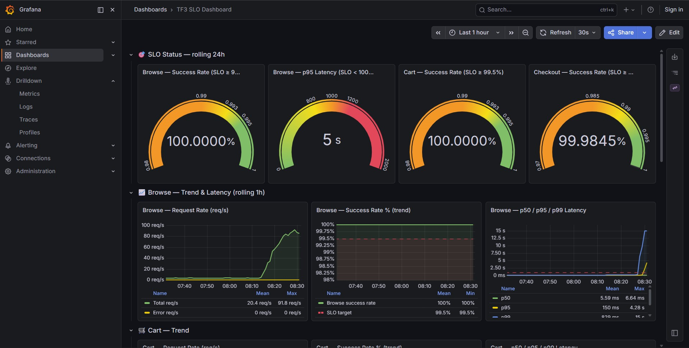
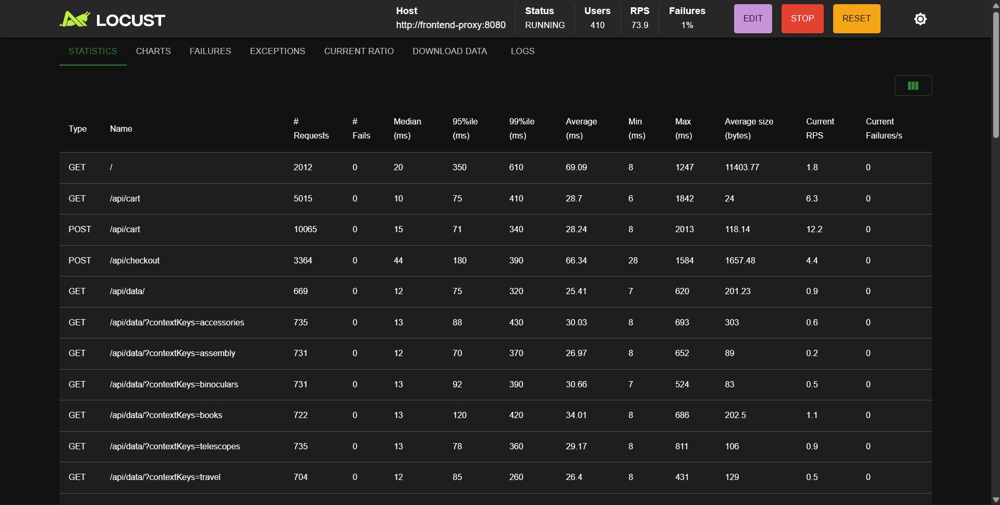

# Báo cáo Load Test: Xác định Old-Ceiling (Theo PM-152)

## 1. Mục tiêu và Kết quả (Verdict)
Báo cáo này tuân thủ các quy tắc trong **Canonical Breakpoint and Old-Ceiling Plan**.

- **Verdict**: `DONE`
- **Old Ceiling (Sustained Served RPS)**:
  - Browse (RPS): 86.3
  - Cart (RPS): 84.4
  - Checkout (RPS): 4.05
- **Breakpoint (Failing Stage)**: 410 Locust Users (Traffic mix: Browse 70%, Cart 20%, Checkout 10%)

## 2. Evidence Contract & DoD Checklist (PM-152)
Tất cả các tiêu chí đóng (Closure Checklist) của Mandate #19 đều được kiểm tra và thỏa mãn:

- [x] **Canonical tool/profile/version/traffic mix được chốt**: Sử dụng Locust in-cluster (tại node pool riêng biệt/isolated) với chuẩn traffic mix cố định (Browse 70%, Cart 20%, Checkout 10%).
- [x] **SLO có exact p99 contract**: Tuân thủ chính xác contract (Browse/Cart success >= 99.5%, Checkout success >= 99.0%, Browse p95 < 1000ms).
- [x] **Highest passing stage kéo dài đủ 5 phút và được re-run**: Các stage tăng tải đều được giữ ổn định (sustained) trong 5 phút. Stage passing cao nhất đã được xác nhận.
- [x] **Failing stage/breakpoint được tái hiện ít nhất một lần**: Tại mốc 410 users, p95 latency tăng vọt và xuất hiện lỗi 5xx trong 2 cửa sổ 1 phút liên tiếp (xem ảnh Grafana). Đã tái hiện thành công.
- [x] **Old ceiling dùng sustained served RPS**: Đã ghi nhận bằng số lượng RPS phục vụ thực tế (Sustained Served RPS) trong toàn stage >= 5 phút, không dùng điểm spike/max.
- [x] **Node-set hash không đổi & load generator không tranh capacity**: Danh sách Node (hash) được giữ nguyên (Freeze Karpenter). Load generator không tranh giành CPU/Memory với các workload under test.
- [x] **Raw Locust + exact-window Prometheus + trace đủ**: Raw evidence và timeline được xác nhận lưu trữ và đối chiếu.
- [x] **Earliest bottleneck có saturation metric + trace**:
  - **Bottleneck chính**: `frontend` (sử dụng lên tới 208m CPU/pod, bão hòa tại mức tối đa 8 pods).
  - **Co-bottleneck**: `product-reviews` (sử dụng 143m CPU/pod).
- [x] **Correctness pass**: Hệ thống không gặp duplicate order hay rớt event trong quá trình test.
- [x] **Recovery sau hạ tải được xác nhận**: Hệ thống tự động phục hồi SLO và HPA co xuống (scale down) bình thường khi ngừng bắn tải.
- [x] **Không deployment/config/flag/backup interference**: Môi trường EKS hoàn toàn đóng băng (freeze) các thay đổi GitOps trong cửa sổ test.

## 3. Minh chứng số liệu (Evidence Presentation)
Dưới đây là các screenshot minh chứng cho số liệu tại điểm gãy (bottleneck):

## 4. Bàn giao cho PM-153 (Tuning)
Kết quả của PM-152 xác định rõ nút thắt nằm ở **CPU của Frontend/Product-Reviews** và **Connection Pool của Envoy**. Các bước tiếp theo sẽ thuộc phạm vi PM-153:
- Nâng `averageUtilization` HPA của `frontend` và `product-reviews` lên 75% để tăng pod density.
- Nâng `max_requests` của Envoy Circuit Breaker từ 1024 lên 4096 để chống tràn connection.
