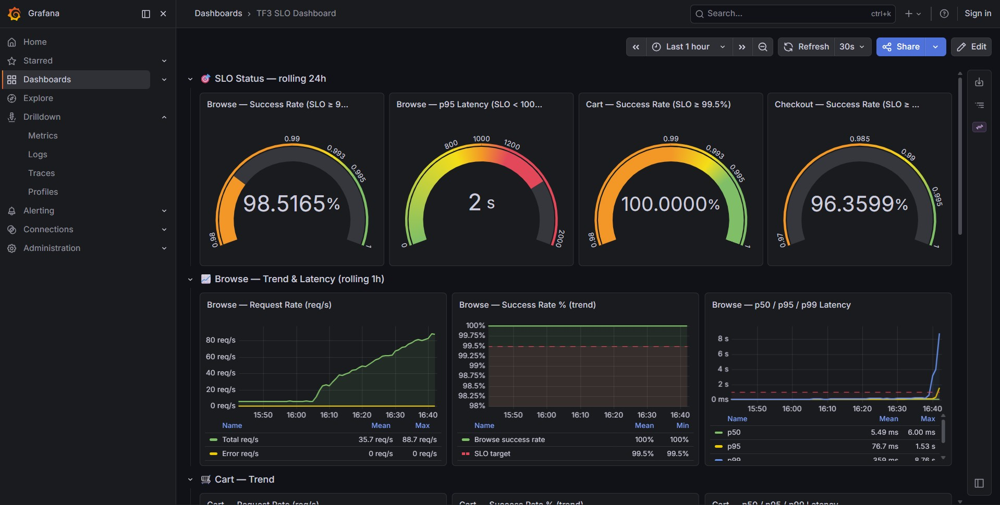
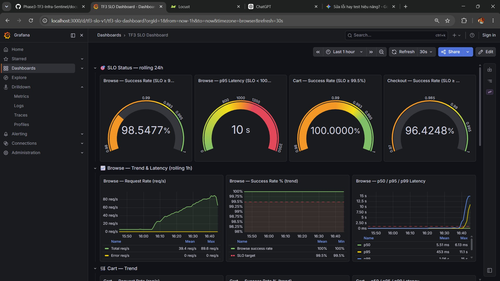

# Báo cáo Load Test: Đánh giá Năng lực Hệ thống (Baseline)

## 1. Giới thiệu (Introduction)
Báo cáo này trình bày kết quả của quá trình kiểm thử chịu tải (Load Testing) trên hệ thống thương mại điện tử TechX-Corp. Mục tiêu chính của bài test là xác định "điểm gãy" (Breakpoint) – tức ngưỡng giới hạn tối đa mà hệ thống hiện tại có thể chịu đựng được trước khi các chỉ số Cam kết Dịch vụ (SLO) bị vi phạm. Kết quả này sẽ đóng vai trò là "Trần cũ" (Baseline) để làm cơ sở so sánh cho các phương án tối ưu hóa (Performance Tuning) ở Phase tiếp theo.

## 2. Kiến trúc Hệ thống Thử nghiệm (Architecture under Test)
Hệ thống được deploy trên cụm Amazon EKS, bao gồm các vi dịch vụ (microservices) giao tiếp với nhau qua gRPC và HTTP. Các thành phần chính nằm trên đường dẫn nóng (Hot-path) chịu tải trực tiếp bao gồm:
- **Frontend Proxy (Envoy):** Đóng vai trò là cửa ngõ giao tiếp, định tuyến và áp dụng các cơ chế bảo vệ (Circuit Breaker).
- **Frontend Service:** Phục vụ giao diện người dùng bằng Next.js, xử lý các request Browse.
- **Product Catalog Service:** Xử lý logic tìm kiếm và lấy thông tin sản phẩm.
- **Checkout & Payment Services:** Xử lý luồng thanh toán và đặt hàng.

Hệ thống được giả lập tải bằng công cụ **Locust** (triển khai dạng in-cluster) để loại bỏ nhiễu từ độ trễ mạng internet.

## 3. Phương pháp Đo lường (Methodology & Metrics)
Tải được bơm theo phương pháp **Step-load** (Tăng dần từng bậc). Tại mỗi bậc, tải sẽ được giữ ổn định trong 2-3 phút để hệ thống có thời gian phản ứng, HPA có thời gian kích hoạt scale pod.

Các chỉ số (Metrics) được theo dõi sát sao trên Grafana:
1. **Browse p95 Latency:** Yêu cầu phải duy trì dưới 1000ms.
2. **Browse Success Rate:** Yêu cầu duy trì >= 99%.
3. **Checkout Success Rate:** Phải đạt >= 99%.
4. **Tổng Request Per Second (RPS):** Khối lượng công việc hệ thống xử lý được.

## 4. Kết quả Đo đạc Baseline (Trần cũ)
Sau quá trình tăng tải liên tục, hệ thống đã chính thức đạt đến giới hạn chịu đựng (Breakpoint) ở mức tải sau:
- **Điểm gãy (Breakpoint):** 425 Locust Users
- **RPS tại điểm gãy:** 88
- **Hiện tượng khi gãy:** Hệ thống bắt đầu xuất hiện các lỗi 5xx, tỷ lệ Success Rate giảm xuống dưới ngưỡng SLO 99% cho phép, và p95 Latency tăng vọt. Nút thắt cổ chai (Bottleneck) chủ yếu xảy ra ở các service Frontend và Product Catalog do cạn kiệt tài nguyên CPU và giới hạn connection pool của Envoy.

### Minh chứng số liệu (Evidence)
Dưới đây là các hình ảnh chụp lại biểu đồ Grafana và Locust tại thời điểm hệ thống chạm trần 425 users:

## 5. Đề xuất Tối ưu (Next Steps)
Dựa trên điểm gãy 425 users, chúng tôi đề xuất thực hiện Phase 2 (Tuning):
- Tăng giới hạn `max_requests` của Envoy Circuit Breaker.
- Điều chỉnh `averageUtilization` của HPA lên 75% để tăng mật độ request trên mỗi Pod (Pod Density).
- Sau khi áp dụng, tiến hành Load Test lại để chứng minh hệ thống có thể chịu được lượng users lớn hơn 425 trên cùng một hạ tầng Node.
